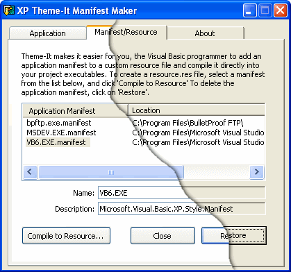



## XP Theme\-It Manifest Resource Maker

### Description

Create a custom manifest for any executable you choose, and force the program to load the new XP style controls based on the current XP Style Theme installed. XP Theme-It can add any created manifest to a custom resource file, so it can be loaded to a VB project and compiled directly into the program's executable. Organize and maintain a list of all manifests created on your system so the visual theme can easily be restored if necessary. Also enables you to create a custom manifest by right-clicking any file from Windows Explorer. If you like this code, please vote for it at PSC.
 
### More Info
 
Project Requirements:

Microsoft Resource Compiler - (RC.EXE)

NOTES:

You need to ensure that any form module using the style theme, initializes the

ComCtl32.dll by calling the ComCtl InitCommonControls

API.

             |
---                |---
**Submitted On**   |2003-03-16 20:14:00
**By**             |[GregM](https://github.com/Planet-Source-Code/PSCIndex/blob/master/ByAuthor/gregm.md)
**Level**          |Advanced
**User Rating**    |4.8 (24 globes from 5 users)
**Compatibility**  |VB 6\.0
**Category**       |[Complete Applications](https://github.com/Planet-Source-Code/PSCIndex/blob/master/ByCategory/complete-applications__1-27.md)
**World**          |[Visual Basic](https://github.com/Planet-Source-Code/PSCIndex/blob/master/ByWorld/visual-basic.md)
**Archive File**   |[XP\_Theme\-I1560743162003\.zip](https://github.com/Planet-Source-Code/gregm-xp-theme-it-manifest-resource-maker__1-43986/archive/master.zip)

